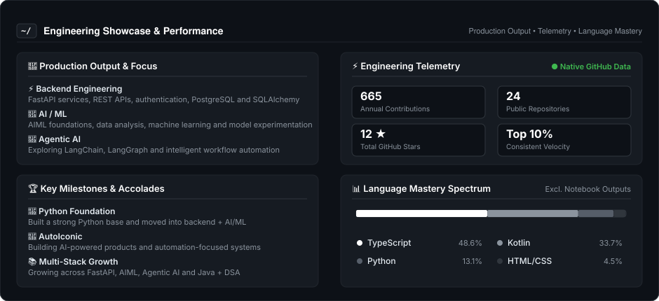

  
  
    

  # JAIDUUU
  
  

    
  

  ### ⚡ Building Backends That Actually Work
  
  **Python • FastAPI • PostgreSQL • SQLAlchemy**

   

  

---

### 👨‍💻 About Me

I'm a backend-focused developer who likes building practical systems instead of just tutorial projects.

* ⚡ **Backend:** Python, FastAPI, REST APIs, authentication and security
* 🗄️ **Data:** PostgreSQL, SQL, SQLAlchemy, database design and joins
* 📊 **Data / ML:** NumPy, Pandas, Matplotlib and machine learning fundamentals
* 🌐 **Full Stack:** HTML, CSS, JavaScript with backend-first application development
* 🚀 **Focus:** Building real-world, industry-oriented projects and improving every day

---

### 📡 Technical Capability & Skills Radar

  

---

### 🛠️ Core Tooling & Technologies

| **Category** | **Technologies** |
| :--- | :--- |
| **Backend** |  |
| **Database** |  |
| **Data & ML** |  |
| **Frontend** |  |
| **Tools & Systems** |  |

---

### 📈 Activity & Contribution Flow

  

---

### ⚡ Engineering Showcase & Performance

  

---

### 🎮 The Human Side

I'm not just a code machine. When the IDE closes, here is who I am:

* **🧠 Build Philosophy:** Understand the problem first, then build the simplest system that solves it well.
* **⚙️ Current Focus:** Going deeper into backend engineering, PostgreSQL, APIs, authentication and deployment.
* **🚀 Project Style:** Prefer real-world projects that teach architecture, debugging and production thinking.

---

  Build it. Understand it. Ship it.

